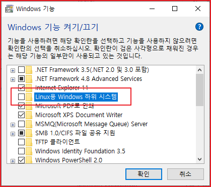

# WSL

도커(Docker)란 간단하게 말해서 가상 PC를 만드는 것으로 흔히 아는 VirtualBox와 같은 것이다. 그러나 Docker는 VirtualBox와는 달리 경량화 되어있고 OS의 제약을 받지 않는다. 포트 할당, 공유 디렉토리 지정 외에 Dockerfile 파일을 만들면 알아서 환경설정에 서버 배포환경을 만들어준다. Dockerfile은 OS 설치 이외에도 git에서 소스를 다운로드 받고 서비스까지 할 수 있는 환경을 만들 수 있다.

윈도우즈에서 Docker를 사용하기 위해서 Windows 10을 사용해야 한다. 예전에는 Docker Toolbox를 설치했어야 했는데 deprecated 되었다. 현재는 WSL2를 설치하면 된다. 필요한 사항을 정리하면 다음과 같다.

* Windows 10 Home 이상  64bit
* WSL2 환경
* Linux Kernal update package 설치 

Docker를 설치하기 전에 Docker가 실행되기 위한 환경을 만들기 위해서 WSL2를 설치할 것이고 Linux Kernal update pakcage를 설치할 것이다. 그리고 Docker는 윈도우즈 환경에서 설치를 한다고 하더라도 Linux가 필요하다. Docker는 Linux 환경위에서 동작하기 때문이다. 그래서 WSL 2를 설치한 이후에 Linux를 설치할 것이다.

## WSL 설치

### Linux용 윈도우즈 하위 시스템 사용 설정

윈도우즈에 설치하려면 Hyper-V가 있어야 하는데 내 윈도우즈는 Home이라서 그런지 Hiper-V가 보이질 않는다.\
[Docker 사이트](https://hub.docker.com/editions/community/docker-ce-desktop-windows/)에 가보니 'Windows 10 Home 64-bit with WSL2'라는 구문이 보여서 WSL2가 무엇인지 찾아 보았다. [Windows 10에 Linux용 Windows 하위 시스템 설치 가이드](https://docs.microsoft.com/ko-kr/windows/wsl/install-win10)란 문서에 설치하는 방법이 설명되어 있다.

제어판의 'Windows 기능 켜기/끄기' 창에서 확인해 보니 'Linux Windows 하위 시스템'이라는 항목이 보였다.




**WSL 2** 에전에는 Oracle Virtual Box와 같은 어플리케이션을 이용해서 Linux를 설치했어야 했는데 윈도우즈에서 이런 앱을 사용하지 않고도 리눅스 시스템을 설치할 수 있게 해준다. 이게 좋은 것이 기존 가상 머신의 오버헤드 또는 듀얼 부팅 설정 없이 대부분의 명령줄 도구, 유틸리티 및 애플리케이션을 수정하지 않고 Windows에서 직접 실행할 수 있다. 가장 좋은 것은 빠르다는 것이다. Docker와는 무관하게 윈도우즈에서 Linux를 돌리고 싶으면 WSL2를 설치하자.

다음을 할 수 있다.

*   Microsoft Store에서 즐겨찾는 GNU/Linux 배포를 선택합니다.

    grep, sed, awk 또는 다른 ELF-64 이진 파일과 같은 일반적인 명령줄 도구를 실행합니다.
* 다음을 포함하여 Bash 셸 스크립트 및 GNU/Linux 명령줄 애플리케이션을 실행합니다.
  * 도구: vim, emacs, tmux
  * 언어: NodeJS, Javascript, Python, Ruby, C/C++, C# 및 F#, Rust, Go 등
  * 서비스: SSHD, MySQL, Apache, lighttpd, MongoDB, PostgreSQL.
* 자체 GNU/Linux 배포 패키지 관리자를 사용하여 추가 소프트웨어를 설치합니다.
* Unix와 같은 명령줄 셸을 사용하여 Windows 애플리케이션을 호출합니다.
* Windows에서 GNU/Linux 애플리케이션을 호출합니다.

Microsoft Store로 가니 Ubuntu, Kali Linux 등의 Linux가 무료로 설치할 수 있도록 링크가 있었다.

일단 "Windows 기능 켜기/끄기' 창에서 'Linux Windows 하위 시스템' 항목을 체크하고 '확인' 버튼을 클릭하였다. 시스템을 다시 시작하라고 한다. 설치 후에 윈도우즈가 없데이트 된다. 문서를 작성하기 위해서 VSCode를 열었더니 WSL이 있다고 extension을 설치할거냐고 묻는다. 일단 설치했다.

### Linux용 Windows. 하위 시스템 사용

Windows에서 Linux 배포를 설치하려면 먼저 "Linux용 Windows 하위 시스템" 옵션 기능을 사용하도록 설정한다. PowerShell을 관리자 권한으로 열어 실행한다.

```
dism.exe /online /enable-feature /featurename:Microsoft-Windows-Subsystem-Linux /all /norestart
```

제어판에서 기능을 켰는데 이것을 또 할 필요는 없을 것 같은데 해 두어도 문제는 없으니 일단 실행하자.

### Virtual Machine 기능 사용 설정

WSL 2를 설치하려면 먼저 Virtual Machine 플랫폼 옵션 기능을 사용하도록 설정해야 한다. 이 기능을 사용하려면 머신에 가상화 기능이 필요하다. 관리자 권한으로 다음을 실행한다.

```
PS D:\> dism.exe /online /enable-feature /featurename:VirtualMachinePlatform /all /norestart
```

다음과 같이 설치가 된다.

```
배포 이미지 서비스 및 관리 도구
버전: 10.0.19041.844

이미지 버전: 10.0.19042.1052

기능을 사용하도록 설정하는 중
[==========================100.0%==========================]
작업을 완료했습니다.
```

아래 명령어를 실행해 보았는데 '가상화가 사용하도록..'과 같은 메시지가 나왔다.

### Linux 커널 업데이트 패키지 다운로드

아래 링크를 클릭하여 다운로드하고 설치한다. [x64 머신용 최신 WSL2 Linux 커널 업데이트 패키지](https://wslstorestorage.blob.core.windows.net/wslblob/wsl_update_x64.msi)

### WSL 2를 기본 버전으로 설정

PowerShell을 열고 이 명령을 실행하여 새 Linux 배포를 설치할 때 WSL 2를 기본 버전으로 설정한다.

```
PS D:\> wsl --set-default-version 2
가상 컴퓨터 플랫폼 Windows 기능을 사용하도록 설정하고 BIOS에서 가상화가 사용하도록 설정되어 있는지 확인하세요.
자세한 정보는 https://aka.ms/wsl2-install을 참조하세요
```

'wsl -l -v' 명령을 입력하면 설치한 각 배포에 할당한 WSL. 버전을 확인할 수 있다고 나온다. 아직 설치한 리눅스가 없어서 다음과 같이 나왔다.

```
PS D:\> wsl -l -v
Linux용 Windows 하위 시스템에 배포가 설치되어 있지 않습니다.
아래의 Microsoft Store에서 배포를 설치할 수 있습니다.
https://aka.ms/wslstore
```

### Linux 배포 설치

리눅스를 설치하기 위해서 사이트 문서의 링크를 클릭했다. 받기를 클릭하고 Ubuntu 20.04 LTS를 받았다. 근데 받은 파일이 어디에 있는지 모르겠다.

.png>)

'시작' 버튼을 클릭했다.

.png>)

명령창이 하나 뜨고 'username'과 'password'를 설정했다.

.png>)

설치가 되면 아래와 같은 화면이 나온다. 'sudo apt update'를 클릭하여 업데이트하라는 메시지가 출려된다.

.png>)

다시 Powershell에서 다음 명령을 입력하여 확인해보니 Ubuntu가 설치된 것으로 나온다.

```
PS D:\> wsl -l -v
  NAME            STATE           VERSION
* Ubuntu-20.04    Running         1
```

그런데 버전 1이네. 버전 변환을 위해 다음 명령을 입력했다.

```
PS D:\> wsl --set-version Ubuntu-20.04 2
변환이 진행 중입니다. 몇 분 정도 걸릴 수 있습니다...
WSL 2와의 주요 차이점에 대한 자세한 내용은 https://aka.ms/wsl2를 참조하세요
가상 컴퓨터 플랫폼 Windows 기능을 사용하도록 설정하고 BIOS에서 가상화가 사용하도록 설정되어 있는지 확인하세요.
자세한 정보는 https://aka.ms/wsl2-install을 참조하세요
PS D:\>
```

'WSL 2를 기본 아키텍처로 설정하려는 경우 이 명령을 사용하여 수행할 수 있습니다.' 라고 설명이 되어 있어서 명령을 실행했는데 '가상설정 어쩌구'가 나온다. 음.

```
 wsl --set-default-version 2
```

시작 메뉴에 설치된 Ubuntu가 보인다.

.png>)

설치 사이트에 나온 대로 'x64 머신용 최신 WSL2 Linux 커널 업데이트 패키지'를 설치하고 PC 리부팅 후에 다시 명령어를 실행했다. 이번에는 성공했다.

```
PS D:\>  wsl --set-version Ubuntu-20.04 2
변환이 진행 중입니다. 몇 분 정도 걸릴 수 있습니다...
WSL 2와의 주요 차이점에 대한 자세한 내용은 https://aka.ms/wsl2를 참조하세요
변환이 완료되었습니다.
```

WSL 2를 기본 버전으로 설정하는 명령을 실행했다.

```
PS D:\>  wsl --set-default-version 2
WSL 2와의 주요 차이점에 대한 자세한 내용은 https://aka.ms/wsl2를 참조하세요
```

### 윈도우즈 터미널 설치

링크를 따라 가서 Windows Termail을 설치한다. Windows Terminal을 실행하면 Ubuntu에 접소할 수 있다. 

.png>)

설치한 Ubuntu의 위치

```
C:\Users\[사용자명]\AppData\Local\Packages\
```

> 이런 생각이 들었다 Ubuntu에서 Docker를 설치하는 것이 가능하다. 왜냐면 Docker는 Linux 환경에서 실행되기 때문이다. 그러니까 WSL을 설치하고 Ubuntu를 설치한 다음에 그 우분투에서 docker를 설치하면 되는데 굳이 Desktop용 Docker를 깔 필요가 있을까? 아직은 잘 몰라서 답을 하지 못하겠다.
>
> 6/29. windows용 docker 삭제했다. 설치한 ubuntu에 직접 docker를 설치했다. Docker for Desktop windows가 꼭 필요하지 않다.

## WSL commands

아래 내용은 설치할 때 참조할 수는 있지만 꼭 필요한 사항은 아니다.

### WSL 실행

WSL을 실행하는 방법이 몇 가지가 있다. 되는 것만 나열하겠다.

* 시작 메뉴에서 설치한 linux distribution을 열 수 있다. 
* PowerShell을 열고 단지 'wsl'만 입력한다. 그러면 설치한 linux distribution으로 들어간다. 

### 여러개의 리룩스 배포판 관리

Windows 10에는 Windowes Subsystem for Linux(WSL)에 설치한 배포본(distribution)을 관리하기 위해서 wsl.exe를 사용한다.

각 배포판은 자신만의 설정을 독립적으로 관리할 수 있다. 배포판에 특정한 명령들을 보기 위해서 'distro.exe /?'를 실행한다.

### 배포판 목록 보기

배포판이 목록에 보이면 설치가 되었고 사용할 준비가 된 것이다.

```
wsl -l
or
wsl --list
```

현재 사용할 수 없는 것까지 포함해서 모두 보고 싶으면 다음 명령을 실행한다.

```
wsl --list --all
```

### 디폴트 배포판 설정하기

defautl WSL distribution을 설정하려면 다음 명령을 실행한다.

```
wsl -s <DistributionName>
or
wsl --setdefault <DistributionName>
```

### Unregister and reinstall a distribution

Linux distribution은 Microsoft Store를 통해 설치될 수 있는데 스토어를 통해서 삭제는 불가능한다. WSL Config는 unregistered/uninstalled할 수 있다.

Unregistering은 또한 배포판 재설치를 허용할 수 있다.

> 일단 unregistered되면, 모든 데이터, 설정과 그 배포판과 관련된 소프트웨어를 모두 영구적을 잃는다.

```
wsl --unregister <DistributionName>
```

재 설치하려면 스토어에 가서 배포판을 선택하고 "Launch"를 선택한다.

### 특정 user로 실행

```
wsl -u <Username>
or
 wsl --user <Username>
```

### 배포판에 디폴트 사용자 변경하기

```
<DistributionName> config --default-user <Username>
```

```
PS D:\> ubuntu2004.exe config --default-user root
```

### 특정 배포판 실행

```
wsl -d <DistributionName>
or
wsl --distribution <DistributionName>
```

## configurations

wsl.conf를 사용하여 subsystem을 실행할 때마다 적용될 기능드을 자동으로 구성한다.

wsl.conf는 각 배포판의 /etc/wsl.conf에 위치해 있다.

아래는 샘플이다.

```
# Enable extra metadata options by default
[automount]
enabled = true
root = /windir/
options = "metadata,umask=22,fmask=11"
mountFsTab = false

# Enable DNS – even though these are turned on by default, we'll specify here just to be explicit.
[network]
generateHosts = true
generateResolvConf = true
```

### Options

옵션 설정에 대해서는 [https://docs.microsoft.com/en-us/windows/wsl/wsl-config#configure-global-options-with-wslconfig](https://docs.microsoft.com/en-us/windows/wsl/wsl-config#configure-global-options-with-wslconfig)의 내용을 참고한다. 나중에 다시 정리하기로 한다.

### 서비스 구동

docker를 사용하려고 하는데 systemctl이 없어서 자동으로 실행이 되지 않는다. WSL 2 는 systemctl을 지원하지 않지만 기존의 service 명령은 지원하므로 daemon 을 띄울 때에 service 명령을 사용해야 한다.service 는 root 만 사용할 수 있는 명령어이므로 다음과 같이 /etc/sudoers 에 한 줄을 추가해 주면 편리하게 구동할 수 있습니다

sudoers 파일 편집하기 위해 root 로 visudo 를 구동한다.

```
sudo visudo
```

모든 사용자가 service 명령을 사용할 수 있도록 추가하고 저장한다.

```
%sudo ALL=NOPASSWD: /usr/sbin/service
```

WSL 에 MySQL 과 redis 를 설치하고 다음 script 를 한 번 실행해 준다.

```
 #!/bin/bash
sudo service mysql start
sudo service redis-server start
```

## WSL 재시작

다음 명령을 실행하면 실행중인 모든 배포와 WSL 2 경량 가상 머신을 종료할 수 있다.

```
wsl --shutdown
```

또는 서비스 관리자에서 LxssManager 를 재시작해도 된다.WSL 을 다시 시작하려면 wsl.exe 명령을 실행해 주면 된다.
